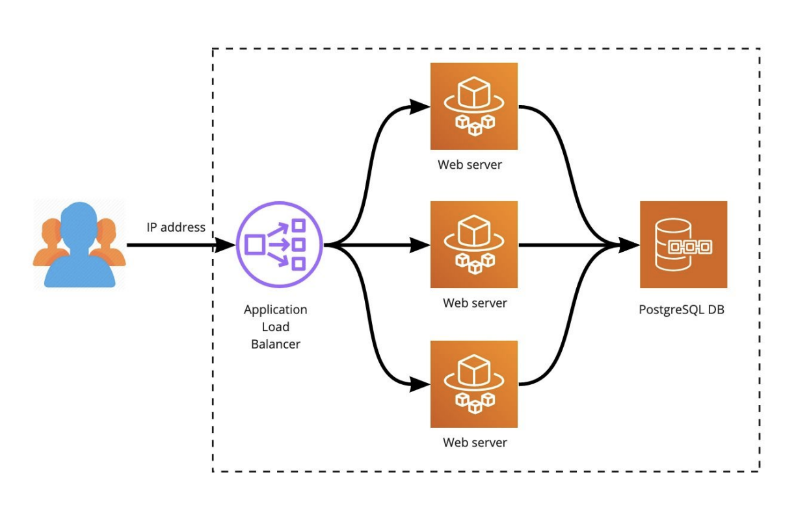

# Terraform Assessment

## Explanation

Configure AWS environment and resources in an automated way.
Your solution should produce a working environment containing publicly accessible load
balancer, with 3 web app servers as backends, and a database server.

## What to do?

Using Terraform, provision AWS VPC inside region/AZs of your choice. VPC should include a
minimum amount of network components required for your solution to work (subnets, routes,
security groups, ngw, igw, etc...). You should provision web app servers behind publicly
accessible LB, web apps should not be publicly accessible and not have public IPs, but should
be able to connect to the Internet. Web apps should serve static web pages with random text.
Database server should run PostgreSQL version > `11.3`. Web apps and database should be on
separate subnets. Database should have firewall rules allowing queries from web apps only.

Stack:
* AWS infrastructure
  * Load Balancer
  * 3 Web Servers
* Docker app:
  * nginx, php-cgi
* Postgres Server

## Expected Results:

1. Terraform to provision the infrastructure
2. Single endpoint serving static web content from 3 web apps
3. Web apps and Postgres can be provisioned using Ansible or container orchestration of your choice k8s, ECS, EKS, etc...
4. Use best practices, the solution should be scalable and secure
5. README file explaining how to implement your solution. **Make sure that code for your solution is not publicly accessible**

## 🛠 Skills
Terraform, AWS, DevOps...

## Authors

- [@akhan4u](https://www.github.com/akhan4u)
